# Warden

Repo monitoring CLI that collects git stats, staleness, debt, complexity, import health, and runtime coverage into structured snapshots. Phase 2 adds AI-powered analysis via `warden analyze`.

## Project Trajectory
The following graph is automatically maintained by the Warden Trajectory Agent to track the project's evolution.

```mermaid
flowchart TD
    %% === PROJECT GOALS ===
    %% Ultimate Goal: Building an autonomous agent orchestration layer for comprehensive repository health monitoring.
    %% Current Goal: Finalizing the event-driven Trajectory system for multi-agent coordination.

    %% === START ===
    %% @project_start [start, closed, 2026-02-24, coldaine]
    project_start("Warden Scaffold Baseline<br/><sub>[2026-02-24]<br/>Initial repository monitoring<br/>architecture and project<br/>structure initialization</sub>")

    %% @ultimate_goal [end, opened, 2026-03-02, coldaine]
    ultimate_goal("Autonomous Orchestration<br/><sub>[Goal]<br/>Fully autonomous multi-agent<br/>coordination and proactive<br/>repository self-healing</sub>")

    %% === PHASE 1-4: CORE FOUNDATION ===
    %% @foundation [ai-task, closed, 2026-02-26, coldaine]
    foundation("Core Engine (Ph 1-4)<br/><sub>[2026-02-26]<br/>Implemented analysis pipeline,<br/>agent handlers, scheduling,<br/>wiki registry, and MCP basics</sub>")

    %% === PHASE 5: WORK MANAGEMENT ===
    %% @work_docs [ai-task, closed, 2026-02-26, coldaine]
    work_docs("Work Documents (Ph 5)<br/><sub>[2026-02-26]<br/>Added escalation logic,<br/>finding-to-work conversion,<br/>and agent dispatch handlers</sub>")

    %% === PHASE 6-7: INTERFACES ===
    %% @surfaces [ai-task, closed, 2026-02-26, coldaine]
    surfaces("Interfaces (Ph 6-7)<br/><sub>[2026-02-26]<br/>Scaffolded web dashboard and<br/>VS Code extension for local<br/>developer environment visibility</sub>")

    %% === PHASE 8-9: INTEGRATION ===
    %% @autonomy_github [ai-task, closed, 2026-02-27, coldaine]
    autonomy_github("Ecosystem (Ph 8-9)<br/><sub>[2026-02-27]<br/>Implemented autonomy<br/>graduation flows and primary<br/>GitHub Webhook integration</sub>")

    %% === PL02 SERIES: INTELLIGENCE ===
    %% @intelligence [ai-task, closed, 2026-02-27, coldaine]
    intelligence("Intelligence (PL02)<br/><sub>[2026-02-27]<br/>Added coverage collectors,<br/>cross-repo portfolio views,<br/>and interactive dashboard controls</sub>")

    %% === PH 4-5: SCALE ===
    %% @expansion [ai-task, closed, 2026-03-02, coldaine]
    expansion("Expansion (Ph 4-5)<br/><sub>[2026-03-02]<br/>Built notification/alerting<br/>pipeline and expanded agent<br/>parallelism for larger tasks</sub>")

    %% === TRAJECTORY SYSTEM (TODAY) ===
    %% @trajectory_core [ai-task, closed, 2026-03-02, coldaine]
    trajectory_core("Trajectory Domain<br/><sub>[2026-03-02]<br/>Built canonical JSON state,<br/>event logging, and safety gates<br/>for work journey tracking</sub>")

    %% @trajectory_ux [ai-task, closed, 2026-03-02, coldaine]
    trajectory_ux("Trajectory UX<br/><sub>[2026-03-02]<br/>Integrated visualization in<br/>Dashboard and MCP tools for<br/>human-AI context alignment</sub>")

    %% === CONNECTIONS ===
    project_start --> foundation
    foundation --> work_docs
    work_docs --> surfaces
    surfaces --> autonomy_github
    autonomy_github --> intelligence
    intelligence --> expansion
    expansion --> trajectory_core
    trajectory_core --> trajectory_ux
    trajectory_ux -.-> ultimate_goal

    %% === RECENT WORK HIGHLIGHT ===
    subgraph recent [RECENT]
        trajectory_core
        trajectory_ux
    end

    %% === STYLES ===
    %% Closed tasks (soft purple)
    style project_start fill:#1a1a2e,stroke:#a78bfa,color:#c4b5fd,stroke-width:1px
    style foundation fill:#1a1a2e,stroke:#a78bfa,color:#c4b5fd,stroke-width:1px
    style work_docs fill:#1a1a2e,stroke:#a78bfa,color:#c4b5fd,stroke-width:1px
    style surfaces fill:#1a1a2e,stroke:#a78bfa,color:#c4b5fd,stroke-width:1px
    style autonomy_github fill:#1a1a2e,stroke:#a78bfa,color:#c4b5fd,stroke-width:1px
    style intelligence fill:#1a1a2e,stroke:#a78bfa,color:#c4b5fd,stroke-width:1px
    style expansion fill:#1a1a2e,stroke:#a78bfa,color:#c4b5fd,stroke-width:1px
    style trajectory_core fill:#1a1a2e,stroke:#a78bfa,color:#c4b5fd,stroke-width:1px

    %% Recent node (highlighted purple)
    style trajectory_ux fill:#2d1f4e,stroke:#c084fc,color:#e9d5ff,stroke-width:2px

    %% Recent subgraph (dashed border)
    style recent fill:transparent,stroke:#c084fc,color:#c084fc,stroke-width:2px,stroke-dasharray:5 5

    %% Open tasks (soft green)
    style ultimate_goal fill:#1a1a2e,stroke:#4ade80,color:#86efac,stroke-width:1px
```



## Setup

```bash
pnpm install
cp .env.example .env   # add your AI provider key
pnpm warden --help
```

## Commands

- `warden init <path>`
- `warden collect [--repo <slug>]`
- `warden report [--repo <slug>] [--analyze] [--compare <branch>]`
- `warden analyze [--repo <slug>]`
- `warden dashboard [--port <n>]`
- `warden prune [--repo <slug>] [--keep <n>]`
- `warden hook install [--repo <slug>]`
- `warden hook uninstall [--repo <slug>]`
- `warden hook tick --repo <slug>`
- `warden wiki <WD-Mx-yyy>`
- `warden mcp [--transport stdio|sse] [--port <n>]`

## AI Analysis

`warden analyze` reads the latest snapshot for each configured repo, optionally computes a delta against the previous snapshot, and calls an AI provider to produce a prioritized maintenance report written to `data/<slug>/analyses/`.

`warden report --analyze` generates the template report and then appends an AI analysis to stdout.

`warden report --compare main` appends a cross-branch delta section by comparing the latest snapshot against the latest snapshot captured on `main`.

Configure the provider via environment variables (see `.env.example`).

## Web dashboard

Start the local dashboard server:

```bash
pnpm warden dashboard
```

By default, it runs at `http://localhost:3333`.

Use a custom port:

```bash
pnpm warden dashboard --port 4000
```

Main routes:

- `/` — multi-repo overview
- `/repo/:slug` — repo detail view
- `/repo/:slug/trends` — trend charts
- `/repo/:slug/work` — work document manager
- `/repo/:slug/agents` — agent activity + trust scores
- `/wiki` and `/wiki/:code` — wiki browser

The dashboard reads data from `data/<slug>/reports`, `data/<slug>/work`, `data/<slug>/trust`, and `wiki/`. Run `warden analyze` (and `warden collect` as needed) to refresh dashboard data.

## Finding codes and wiki

Phase 4 introduces stable finding codes (`WD-Mx-yyy`) and wiki pages in `wiki/`.

- `warden report` includes code references in metric sections plus a finding-code summary.
- `warden wiki <code>` prints the wiki page for a finding code.

## Allowlists and suppressions

- Global allowlist: `config/<slug>.allowlist`
- Repo-local override: `<repo>/.warden/allowlist`

Allowlist entries suppress specific finding codes for paths (or `path:symbol` entries).

`config/repos.json` also supports `suppressions` for repo-managed pattern suppressions.

## MCP server

`warden mcp` starts an MCP server exposing Warden resources and tools.

- Default transport: `stdio`
- Optional HTTP streamable mode: `warden mcp --transport sse --port 3001`

Resources include `warden://repos`, `warden://findings`, repo snapshot/report URIs, and `warden://wiki/{code}`.

## Scheduling

Use cron/systemd/launchd examples in `docs/scheduling.md` to run Warden automatically on a weekly cadence.

## Threshold tuning

Threshold defaults and semantics are documented in `docs/thresholds.md`.

## Scope config

`warden init` generates `config/<slug>.scope` as a `.gitignore`-style file-scoping config.

- Ignore-only patterns skip all metrics.
- `[metrics: ...]` blocks scope files to selected metrics.
- Target repo `.warden/scope` takes precedence when present.

## Runtime tracking connector

`packages/warden-connector` provides `@aspect/warden-connector` with `withTracking()` middleware that appends route hit events to `.warden/runtime/api-hits.jsonl`.

## V8 coverage

See `docs/v8-coverage-dev-session.md` for the dev workflow used by `collect-runtime`.

See `PH01-warden-phase-1.md` for the implementation sequence.
