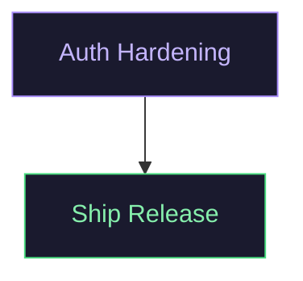

# Trajectory System

Track project history and work progress as a queryable graph linked to Warden findings.

## Status

- Implemented: Layer 1-5 (canonical domain, CLI, MCP, dashboard, safety)
- Storage: `data/<slug>/trajectory/state.json`

## Quick Start

Initialize trajectory for a repo:

```bash
pnpm warden trajectory init --repo <slug>
```

Import from existing `vizvibe.mmd`:

```bash
pnpm warden trajectory import --repo <slug> --from vizvibe.mmd
```

Export to Mermaid:

```bash
pnpm warden trajectory export --repo <slug> --to vizvibe.mmd
```

Validate graph integrity:

```bash
pnpm warden trajectory validate --repo <slug>
```

Apply a patch (from JSON operations file):

```bash
pnpm warden trajectory patch --repo <slug> --ops changes.json --rev 5
```

## Data Model

Trajectory state is stored at `data/<slug>/trajectory/state.json`:

```json
{
  "version": 1,
  "repoSlug": "my-repo",
  "nodes": [
    {
      "id": "auth-hardening",
      "title": "Harden authentication flow",
      "status": "opened",
      "type": "task",
      "createdAt": "2026-03-02T00:00:00.000Z",
      "updatedAt": "2026-03-02T00:00:00.000Z",
      "findingRefs": ["WD-M2-014"],
      "workRefs": [],
      "tags": ["security", "auth"],
      "metadata": {}
    }
  ],
  "edges": [
    {
      "from": "auth-hardening",
      "to": "ship-release-12",
      "kind": "blocks",
      "metadata": {}
    }
  ],
  "meta": {
    "revision": 0,
    "updatedAt": "2026-03-02T00:00:00.000Z",
    "lastActiveNodeId": "auth-hardening"
  }
}
```

### Node Fields

| Field | Type | Description |
|-------|------|-------------|
| `id` | string | Unique identifier |
| `title` | string | Display title (max 30 chars recommended) |
| `status` | enum | `opened`, `closed`, `blocked`, `deferred` |
| `type` | string | `task`, `start`, `epic`, etc. |
| `findingRefs` | string[] | Linked finding codes (e.g., `WD-M2-014`) |
| `workRefs` | string[] | Linked work document IDs |
| `tags` | string[] | Categorical tags |
| `metadata` | object | Arbitrary key-value data |

### Edge Fields

| Field | Type | Description |
|-------|------|-------------|
| `from` | string | Source node ID |
| `to` | string | Target node ID |
| `kind` | string | Relationship type (`blocks`, `dependsOn`) |
| `metadata` | object | Arbitrary key-value data |

## Patch Operations

Modify the graph via JSON patch operations:

```json
[
  {
    "type": "addNode",
    "node": {
      "id": "new-feature",
      "title": "Add new feature",
      "status": "opened",
      "type": "task",
      "findingRefs": [],
      "workRefs": [],
      "tags": [],
      "metadata": {}
    }
  },
  {
    "type": "addEdge",
    "edge": {
      "from": "new-feature",
      "to": "existing-node",
      "kind": "blocks",
      "metadata": {}
    }
  },
  {
    "type": "updateNode",
    "id": "existing-node",
    "updates": { "status": "closed" }
  }
]
```

Operation types: `addNode`, `updateNode`, `addEdge`, `deleteNode`, `deleteEdge`.

## Validation

The system enforces:

- Unique node IDs
- Valid edge references (both endpoints must exist)
- No cycles in dependency edges
- Optimistic concurrency (revision-based)

## Integration Points

### MCP Tools

Available to AI agents:

- `warden_trajectory_init` - Initialize trajectory for a repo
- `warden_trajectory_get` - Get current graph
- `warden_trajectory_import` - Import from Mermaid
- `warden_trajectory_export` - Export to Mermaid
- `warden_trajectory_patch` - Apply patch operations

### Dashboard

View trajectory at: `http://localhost:3333/repo/:slug/trajectory`

### Linking to Findings

Nodes can reference Warden findings via `findingRefs`. This enables:

- Traacing work back to code health signals
- Prioritization by severity
- Impact analysis

## Mermaid Compatibility

The system can import/export Mermaid flowchart syntax:



Metadata annotations use the format:
```
%% @node-id [type, status]: description
```

## File Locations

| Component | Path |
|-----------|------|
| Types | `src/types/trajectory.ts` |
| Storage | `src/work/trajectory-store.ts` |
| Validation | `src/work/trajectory-invariants.ts` |
| Mermaid adapter | `src/work/trajectory-vizvibe.ts` |
| CLI commands | `src/cli/commands/trajectory.ts` |
| MCP tools | `src/mcp/tools.ts` (trajectory section) |

## Safety Features

- All mutations go through `TrajectoryStore.patch()` with validation
- Cycle detection prevents dependency loops
- Optimistic concurrency prevents lost updates
- Revision tracking enables audit history
